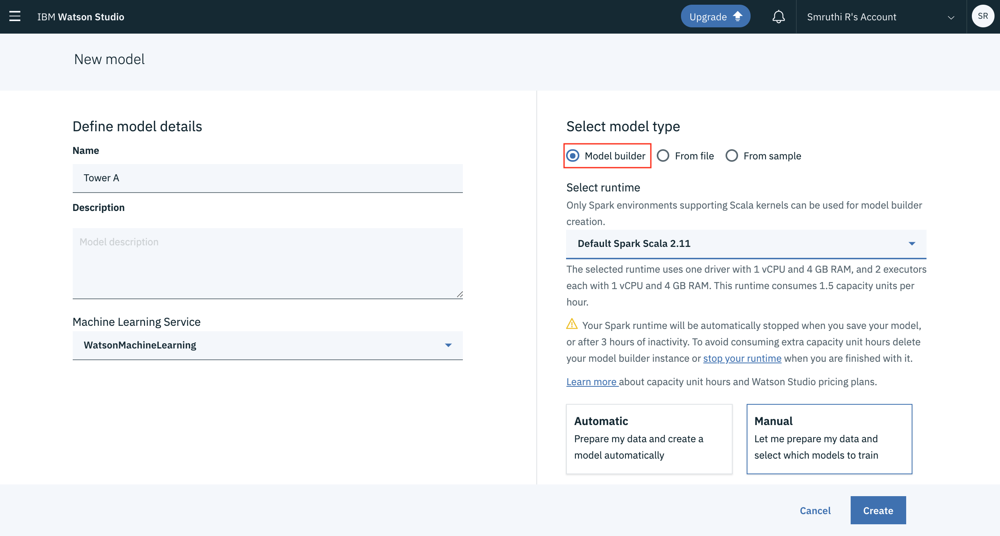
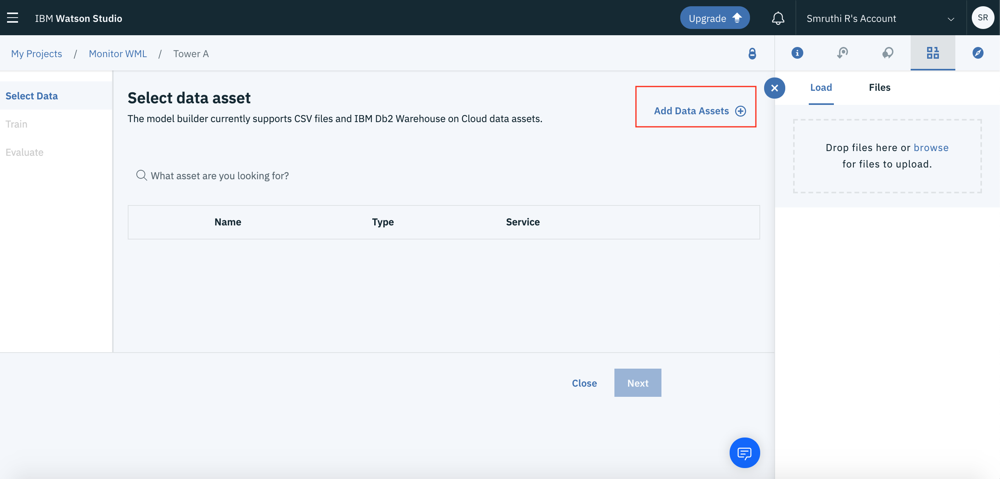
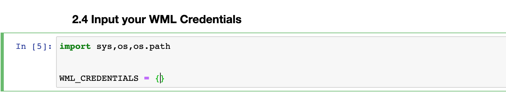

# WORK IN PROGRESS
# Monitor your ML Models using Watson OpenScale

## Pre-requisites
* [IBM Cloud Pak for Data]() Or [IBM Cloud Account](https://cloud.ibm.com/)


## Steps
1. [Create a new Watson Studio Project]()
2. [Add a new Watson Machine Learning Model]()
3. [Build your own Machine Learning Model with WML Model Builder]()
4. [Create a new Watson OpenScale instance on IBM Cloud]()
5. [Create a new Watson Studio Python Notebook on IBM Cloud]()
6. [Launch the Watson OpenScale add-on on IBM Cloud Pak for Data]()
7. [Create a new Project in your IBM Cloud Pak for Data instance]()
8. [Configure Credentials in your Notebook]()
9. [Run the Inital Scoring and Payload Logging]()
10. [Configure the Quality and Fairness Monitors on Watson OpenScale]()
11. [Add Feedback Data to setup your dashboard on Watson OpenScale]()


### 1. Create a new Watson Studio Project

* On IBM Cloud create a new [Watson Studio](https://cloud.ibm.com/catalog/services/watson-studio)

  
  
* Make sure to set the location to `Dallas`, select the appropriate plan and hit Create.
* Go to your [IBM Cloud Dashboard](https://cloud.ibm.com/)
* Click on `resources>services` select your Watson Studio Service and click on `Get Started`.
* Create a new Project as shown below-
  
  
  
* If you don't have a Cloud Object Storage Instance then follow the onscreen steps to create a new Cloud Object Storage Instance.

### 2. Add a new Watson Machine Learning Model

* Click on `Add to Project` and select `Watson Machine Learning` option.
* If you already have a WML instance, make sure it is in the `Dallas` region. If not, follow the steps as below-
  

```Note: Ensure your WML region is Dallas```
* Select `model type> model builder`
* Select `runtime> Default Spark Scala 2.11`
* Select the `Manual` option
  
* Give your model a name and hit create.

### 3. Build and Deploy your own Machine Learning Model with WML Model Builder

* Clone the repo using the `Clone or Download` button or by typing the below command in a desired directory in your command line.

```
    git clone https://github.com/IBM/icp4d-telco-monitor-models-with-wml-openscale.git
```
* In your IBM Cloud, open the created model. Click on `Add Data Assets`. Navigate to the `dataset` folder in the downloaded repo, add the file and select the file. 

  
  
* Once your dataset is loaded, setup the Target Column, Feature Column, Type of Classification or Regeression and an Estimator.

  
  
```
  Note: The parameters you set will be different from the above steps, in case of a different dataset and use-case.
```
* Once the model is trained click on `Save` and store your model.
* To Deploy the created model, go to `Deployments>Add a Deployment`

  

```
  Note: 
      1. If you are using IBM Cloud follow steps 4-5 and then continue with step 8
      2. If you are using IBM Cloud Pak for Data ignore next few steps and start from step 6
  
```

  
### 4. Create a new Watson OpenScale instance on IBM Cloud

* In your IBM Cloud, create an new [Watson OpenScale Instance](https://cloud.ibm.com/catalog/services/watson-openscale)
* Configure the Db for OpenScale. In this we use a Free-Lite Plan, you may choose any other db depending on your requirement.

  
  
* Bind your created WML instance to OpenScale, following the on-screen instructions as shown below-

  
  
 * Click on `Go to Dashboard`. Then select `Add Deployments`. Add the most recent deployment.
 
  
  
* Click on `Configure Monitors`. Select the appropriate data type and algorithm type, according to your custom model. If you are using the same dataset as our example, follow the below steps-
 
   
  
 
 ### 5. Create a new Watson Studio Python Notebook on IBM Cloud
 
 * Go back to your Watson Studio Project Landing Page.
 * Click on `Add to Project> Notebook`.
 * Go to the `From URL` tab and enter the notebook URL- 
  ``` Attach one Screenshot
  ```
  ### Configure Credentials
  * Open your WML instance from your IBM Cloud Dashboard.
  * Go to `Service Credentials` tab, click on `View Credentials` and copy it.
  
   
   
  * Open your Watson Studio notebook-
  * Paste the copied credentials in the `WML_CREDENTIALS` variable.
  
 ### 8. Run the Inital Scoring and Payload Logging
  * Insert the Pandas Dataframe of the Training Data
  
    
    
  * Run the Notebook.
    ``` Add Details on Notebook running
    ```
  * Go back to Watson OpenScale and click on `I'm Finished`

### 9. Configure Credentials

  * 
