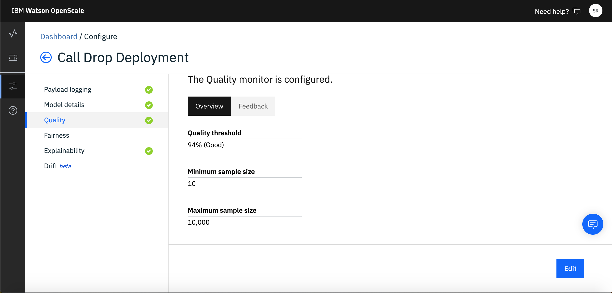
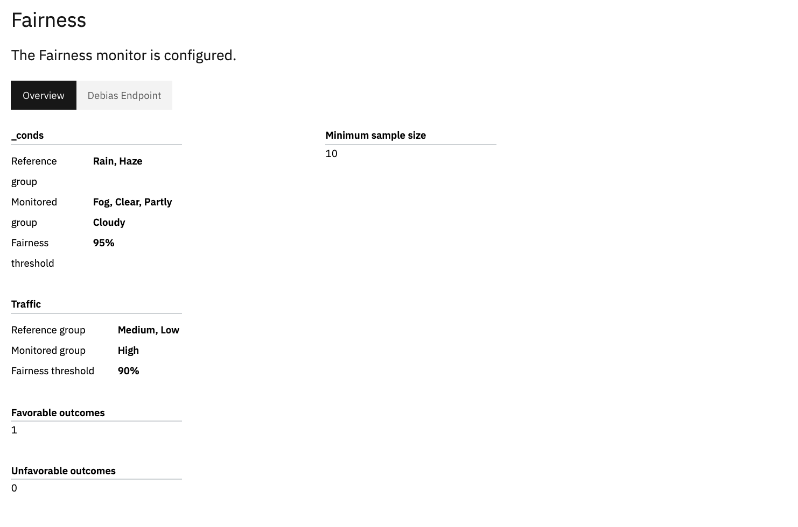

# WORK IN PROGRESS
# Monitor your ML Models using Watson OpenScale

Businesses today are increasingly certain that AI will be a driving force in the evolution of their industries over the next few years. To successful infuse AI into your product or solution, there are many that factors that challenges its widespread adoption in the business and achieve their expected outcomes. A few listed below-

  1. Building Trust- Organisations and businesses tend to be skeptical about AI because of its "black box" nature. Because of this many promising models don't go into production.
  2. Algorithm bias- Another inherent problem with AI systems is that they are only as good – or as bad – as the data they are trained on. If the input data is filled with racial, gender, communal or ethnic biases your model's accuracy is going to eventually drift away.
  3. Making Decisions Explainable- How can the model prove the reasoning behind the it's decision-making? It is critical that AI outcomes are fully explainable by keeping a complete track of inputs and outputs of any AI-powered application.  

What if there is one console that makes it easier for business users to track and measure AI outcomes? 

In this Code Pattern we demonstrate a way to Monitor your AI models in an application using Watson OpenScale. This will be demonstrated with an example of a Telecomm Call Drop Prediction Model. After the user has completed the code pattern, they will learn-

  * How to store custom models using open source technology on Watson Machine Learning.
  * How to deploy a model and connect the model deployment to Watson OpenScale on Cloud Pak for Data and on IBM Cloud.
  * How to setup Model Fairness and Model Quality montiors and Watson OpenScale on Cloud Pak for Data and on IBM Cloud, using   python notebook.
  * How to create a project and setup a python notebook on Cloud Pak for Data.
  
## Pre-requisites
* [IBM Cloud Pak for Data]() (Srikanth fill)

## Architecture Diagram
  


1. Data stored into Cloud Pak for Data internal Db.
2. The joined data is stored back to the Internal Db of Cloud Pak for Data and Assigned to the current working project.
3. Create ML Models using Jupyter Python Notebooks to predict Call Drop, for one cell tower at a time.
4. Model trained and/or stored in Watson Machine Learning, which is also connected to the AI OpenScale.
5. Configure Fairness, Quality and Explainability Montiors for each Tower's model, present within Cloud Pak for Data or on other external Clouds (Multi-Cloud Architecture).


## Steps
1. [Create a new Project on your Cloud Pak for Data instance](1-create-a-new-project-on-your-cloud-pak-for-data-instance)
2. [Add a new Watson Machine Learning Model]()
3. [Create a new Python Notebook on your Cloud Pak for Data Project]()
4. [Configure Watson OpenScale on Cloud Pak for Data]()
7. [Create a new Project in your IBM Cloud Pak for Data instance]()
8. [Run the Inital Scoring and Payload Logging]()
9. [Configure the Quality and Fairness Monitors on Watson OpenScale]()
10. [Add Feedback Data to setup your dashboard on Watson OpenScale]()


### 1. Create a new Project on your Cloud Pak for Data instance

* Once you login to your Cloud Pak for Data instance. Click on the `menu` icon in the top left corner of your screen and then click on `Projects`.
   
   
* When you reach the Project list, click on `New Project`. You will get a pop-up, make sure to have the `Analytics Project` option and enter the desired name. Once you click on `Ok` you will go to a new screen. Click on `Create` to complete your project creation.

### 2. Add a new Watson Machine Learning Model

* Create a new [Watson Machine Learning](https://cloud.ibm.com/catalog/services/machine-learning) instance on IBM Cloud. Log in to IBM Cloud or sign up for IBM Cloud if you don't have an account by following the on-screen instructions.

* Select the location to `Dallas` region and hit create.
  
* Once the instance is created. Click on `Service Credentials`. Click on `New Credentials` and then click on `View Credentials`. Copy using the icon. 
  

```
NOTE: Save the credentials. It will be required during the later stages.
```

### 3. Create a new Python Notebook on your Cloud Pak for Data Project

 * Go back to your Cloud Pak for Data Project Landing Page.
 * Click on `Notebook>Add Notebook`.
 * Go to the `From URL` tab and enter the notebook URL- https://github.com/IBM/icp4d-telco-monitor-models-with-wml-openscale/blob/master/notebook/Setup_your_AIOS_Dashboard.ipynb
  ``` Attach one Screenshot
  ```
  ### Configure Credentials
  * Open your Watson Studio notebook-
  * Paste the copied credentials in the previous step in the `WML_CREDENTIALS` variable (Update according to notebook).

  ``` Attach one Screenshot
  ```

### 4. Configure Watson OpenScale on Cloud Pak for Data

 * Open a Watson Openscale add-on on Cloud Pak for Data. Click on the `add-on` icon on top right of the instance, and the click on `options>Open` for OpenScale Add-on.
  
  
 
 * Click on `Configure>Database`. Add your Db2 Cloud credentials or your internal db credentials on Cloud Pak for Data.
 
  

```
  Note:
    1. If you are adding Db2 on Cloud, ensure you have a Standard Plan and you select the Dallas Region
    2. Create an Empty Schema in your Db. OpenScale will NOT recognise schemas that already have some data.
```
 * Click on `Machine learning providers`. Click on `Add Machine Learning Providers`. Enter the `WML Credentials` that you had copied in an earlier step. Click on `Save`.
 
 
 ### 8. Run the Inital Scoring and Payload Logging
  * Insert the Pandas Dataframe of the Training Data
  
    
    
  * Run the Notebook. 
    ``` Add Details on Notebook running
    ```
    
  * Go back to Watson OpenScale and click on `I'm Finished`

### 9. Configure the Quality and Fairness Monitors on Watson OpenScale

  * Setup the Quality Monitor. This Quality Monitor has a threshold accuracy value that can be set to give an alert, if your model doesn't give a an accuracy below a certain level.
  
    
 * For this example, setup the `Quality Threshold`, `Minimum Sample Size` and `Maximum Sample Size` as shown below:
 
    
  * The Watson OpenScale, monitors the intricate bias that creeps into your model. We can choose which fields we want to monitor and set up a `Fairness Threshold` which will raise an alert beyond a certain value. 
  
  For the example, follow the on-screen instructions and set the configuration as shown below-
  
   
  
### 10. Add Feedback Data to setup your dashboard on Watson OpenScale

* Once you have setup all the monitors, you can add `Feedback Data` by following the steps below-

  
* Navigate to this cloned repo, `Dataset>TowerC_Feedback.csv`.


## Sample Output


