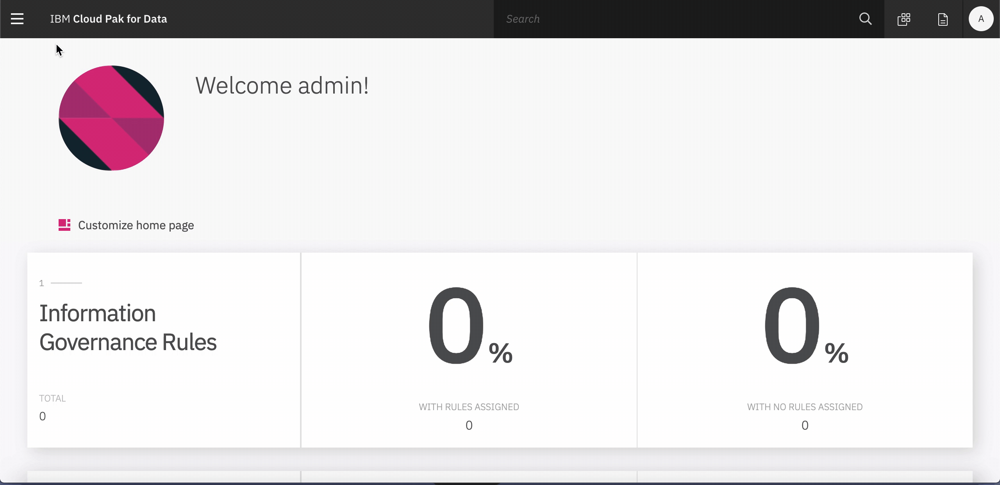
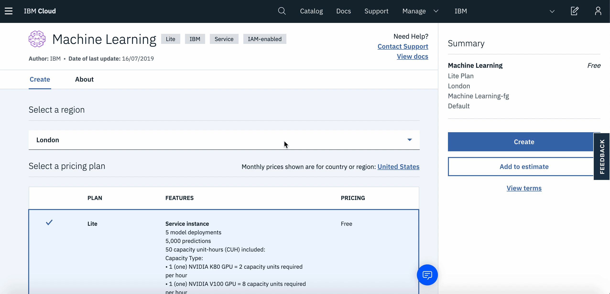
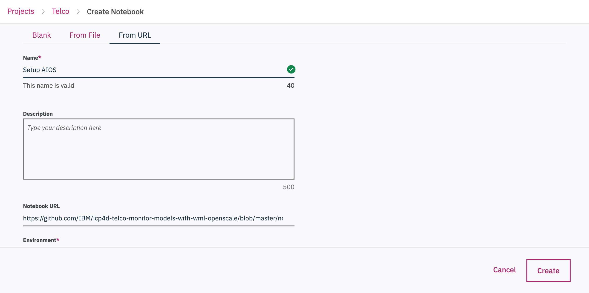
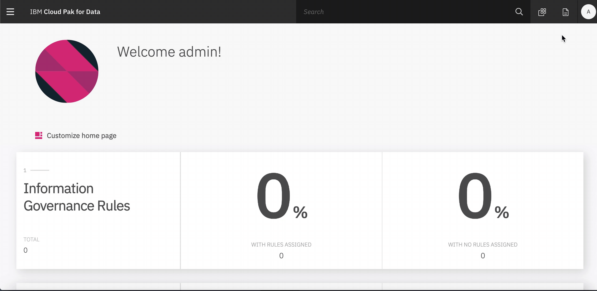
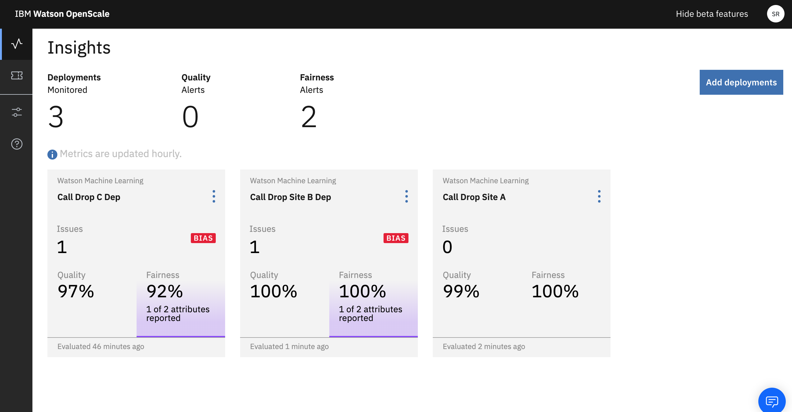
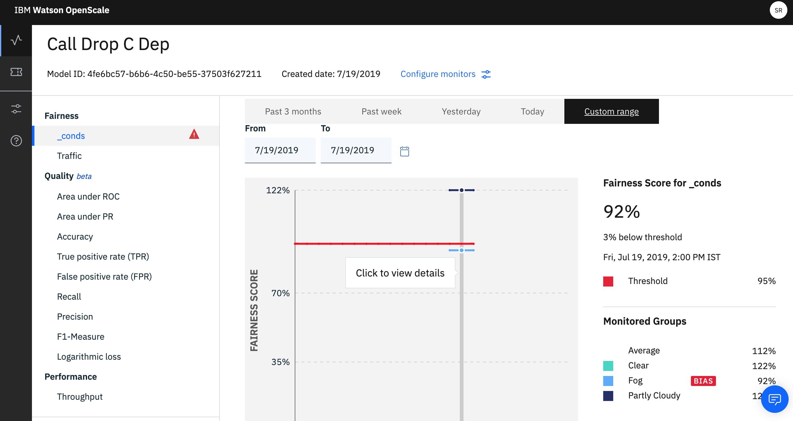
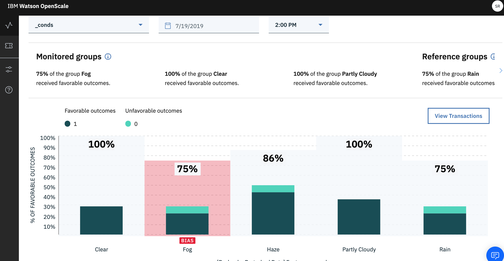
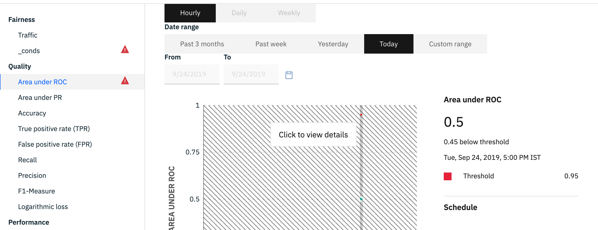
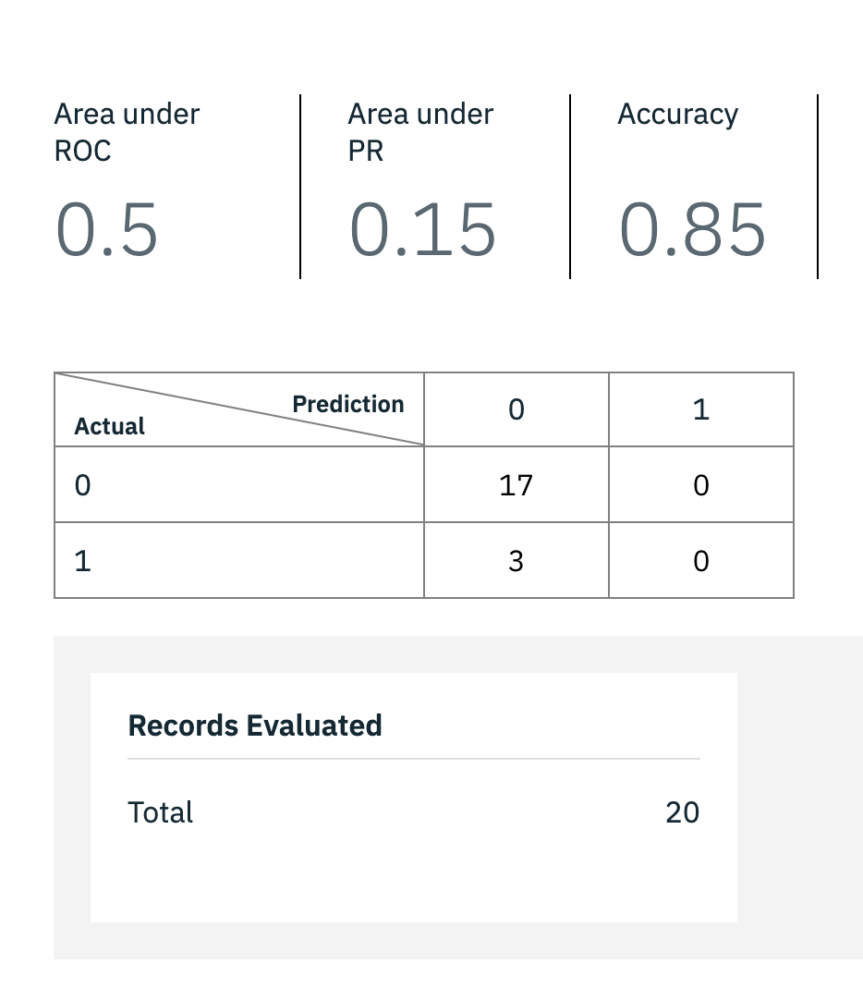

# WORK IN PROGRESS
# Monitor your ML Models using Watson OpenScale

Businesses today are increasingly certain that AI will be a driving force in the evolution of their industries over the next few years. To successful infuse AI into your product or solution, there are many that factors that challenges its widespread adoption in the business and achieve their expected outcomes. A few listed below-

  1. Building Trust- Organisations and businesses tend to be skeptical about AI because of its "black box" nature. Because of this many promising models don't go into production.
  2. Algorithm bias- Another inherent problem with AI systems is that they are only as good – or as bad – as the data they are trained on. If the input data is filled with racial, gender, communal or ethnic biases your model's accuracy is going to eventually drift away.
  3. Making Decisions Explainable- How can the model prove the reasoning behind the it's decision-making? It is critical that AI outcomes are fully explainable by keeping a complete track of inputs and outputs of any AI-powered application.  

What if there is one console that makes it easier for business users to track and measure AI outcomes? 

In this Code Pattern we demonstrate a way to Monitor your AI models in an application using Watson OpenScale. This will be demonstrated with an example of a Telecomm Call Drop Prediction Model. After the user has completed the code pattern, they will learn-

  * How to store custom models using open source technology on Watson Machine Learning.
  * How to deploy a model and connect the model deployment to Watson OpenScale on Cloud Pak for Data and on IBM Cloud.
  * How to setup Model Fairness and Model Quality montiors and Watson OpenScale on Cloud Pak for Data and on IBM Cloud, using   python notebook.
  * How to create a project and setup a python notebook on Cloud Pak for Data.
  
## Pre-requisites
* [IBM Cloud Pak for Data](https://www.ibm.com/in-en/products/cloud-pak-for-data) 
* [OpenScale add-on for Cloud Pak for Data](https://cloud.ibm.com/docs/services/ai-openscale-icp?topic=ai-openscale-icp-inst-install-icp )

## Architecture Diagram
  


1. Data stored into Cloud Pak for Data internal Db.
2. The joined data is stored back to the Internal Db of Cloud Pak for Data and Assigned to the current working project.
3. Create ML Models using Jupyter Python Notebooks to predict Call Drop, for one cell tower at a time.
4. Model trained and/or stored in Watson Machine Learning, which is also connected to the AI OpenScale.
5. Configure Fairness, Quality and Explainability Montiors for each Tower's model, present within Cloud Pak for Data or on other external Clouds (Multi-Cloud Architecture).


## Steps
1. [Create a new Project on your Cloud Pak for Data instance](#1-create-a-new-project-on-your-cloud-pak-for-data-instance)
2. [Add a new Watson Machine Learning Instance](#2-add-a-new-watson-machine-learning-instance)
3. [Create a new Python Notebook on your Cloud Pak for Data Project](#3-create-a-new-python-notebook-on-your-cloud-pak-for-data-project)
4. [Configure your Python Notebook on Cloud Pak for Data](#4-configure-your-python-notebook-on-cloud-pak-for-data)
5. [View your Watson OpenScale Dashboard on Cloud Pak for Data]()

### 1. Create a new Project on your Cloud Pak for Data instance

* Once you login to your Cloud Pak for Data instance. Click on the `menu` icon in the top left corner of your screen and then click on `Projects`.
   
   
* When you reach the Project list, click on `New Project`. You will get a pop-up, make sure to have the `Analytics Project` option and enter the desired name. Once you click on `Ok` you will go to a new screen. Click on `Create` to complete your project creation.

### 2. Add a new Watson Machine Learning Instance

* Create a new [Watson Machine Learning](https://cloud.ibm.com/catalog/services/machine-learning) instance on IBM Cloud. Log in to IBM Cloud or sign up for IBM Cloud if you don't have an account by following the on-screen instructions.

* Select the location to `Dallas` region and hit create.
  
* Once the instance is created. Click on `Service Credentials`. Click on `New Credentials` and then click on `View Credentials`. Copy using the icon. 
  

```
NOTE: Save the credentials. It will be required during the later stages.
```

### 3. Create a new Python Notebook on your Cloud Pak for Data Project

 * Go back to your Cloud Pak for Data Project Landing Page.
 * Click on `Notebook>Add Notebook`.
  
 * Go to the `From URL` tab and enter the notebook URL- https://github.com/IBM/icp4d-telco-monitor-models-with-wml-openscale/blob/master/notebook/Setup_your_AIOS_Dashboard.ipynb
 
  
  

### 4. Configure your Python Notebook on Cloud Pak for Data

 ```
 Note: The following steps are very important. Be sure to not miss any of them. Also, it is recommended that you run each cell one by one in the notebook.
 ```
 
 1. [Install the Necessary Packages](#4-1-install-the-necessary-packages)
 2. [Configure the Necessary Details](#4-2-configure-the-necessary-details)
 3. [Add the dataset](#4-3-add-the-dataset)
 4. [Add the subscription id](#4-4-add-the-subscription-id)
 
 #### 4.1 Install the Necessary Packages
 
 * Click on the `Run` icon and install the necessary packages given in each cell.
 * Next, restart your kernel by either clicking the restart icon or `Kernel>Restart`.
 
 #### 4.2 Configure the Necessary Details
 
 * Under `Section 2.1 Global Variables` enter the following-
    a) Your desired Model Name
    b) Your desired Model Deployment Name
    c) The name of an `empty` schema in your database
    ```
    Note: Pls make sure you have an empty schema, ie has no content at all in it. 
    ```
 * Under `Section 2.3 Add your WML Credentials`. Add the credentials you had copied earlier in a previous step, while creating the instance.
 * Under `Section 2.4 Update your AIOS Credentials`. Add the necessary instance details as instructed in the cell.
    a) Replace the <> with the information within the brackets.
 * Under `Section 2.5 Add your Db Credentials`. Add your db credentials and make sure the keys given in the template have     values filled in. (ie, hostname, username, db, port, etc.)
 
 #### 4.3 Add the Dataset
 
 * Go back to your Project Landing Page. 
 * Clone this repo, by clicking on `Clone or Download`, unzip it and navigate to the `datasets` folder.
 * In your Project Page. Click on `Dataset>Add new Dataset> Browse`. Select the dataset downloaded.
 
   
    
 * Now, open your notebook again and click on the cell under `Section 2.2 Add Dataset`.
 * Click on the `10/01` icon and select the `Insert to code` option. Under that select `Insert Pandas Dataframe` option.
 
    
    
  #### 4.4 Add the Subscription Id

  * Now Start Running the notebook from `Section 1.2 till the end of Section 4.5`
  * Before runnning the remaining (again, pls keep in mind it is better run cell by cell), update the variable `subscription_id` under `Section 4.6`, with id you have just created.
  * You will find this id in the table above, as instructed in the notebook.
  * Now, run the rest of the notebook till the end.
    

## 5. Sample Output

* Open the Watson Openscale add-on on Cloud Pak for Data. Click on the `add-on` icon on top right of the instance, and the click on `options>Open` for OpenScale Add-on.
  
  
  
* You will see a dashboard setup for your model. Below is a screenshot of more than one deployment of different towers of a similar dataset as given in this repo-

### 5.1 Introduction to the Use-Case

  * The dashboard consists of Call Drop Prediction Models for 3 different towers- A, B and C.
  * OpenScale is configured so as to monitor how your models are performing over time. So the below secreenshot, gives one such snapshot.
  
   
  
  * As we can see, the model for Tower C demonstrates a fairness bias warning of 92%. 
  
    #### What is a fairness-bias and why do we need to mitigate it?
     Data in this day and age comes from the most wide variety of sources. Being able to give the 
     right input to a machine learning model is crucial to a succesful ML implementation in an
     application. But, if the underlying data is biased in any form, there is a risk that
     structural inequalities and unfair biases are not just replicated, but also amplified. 
     Hence, AI OpenScale is useful when you need to identify the bias, in a real-time basis (ie, 
     as and when payload flows into your ML system).
  
  Now, that we have identified a bias, let us see the consequence of the bias and what exactly is
  causing the bias in this example.
     
### 5.2 Understanding Bias and a brief on de-biasing

  * Select the desired deployment the `options>View Details`. You will see a full Dashboard with
  various charts telling you how your model has been performing over various time intervals.
  
  You may not receive the same values as the below screenshots, since, we have only done an
  initial setup as of now you will have only one line in your charts.

   
    
  * Now select `_conds` as shown in the image above and hover over the graph. Select 
  `Click to view details`. Select the timeline, according to your current date. 
  
  To interpret the details, have a look at the screenshot below-
  
   
    
  1. Our dataset contains the fields- `Clear`,`Fog`,`Haze`, `Partly Cloudy`, `Rain`. The graph
  above suggests the field `Fog` contains a bias. 
  2. **Now, what does this really mean?**
    As we can see with the legend- we have the Favorable Outcome and Unfavorable Outcome. With
    this bias value we see that with the field value `Fog` compared to the values has a lesser %
    of favorable outcomes. Why does this affect my model? It creates a disparity and thereby
    allowing your model to be biased towards the unfavorable outcome in case of `fog`. 
  3. **Ok, so how does it really matter to me?**
    The best way to explain the consequence of the disparity is by taking this example, suppose we
    allow the disparity to creep in. Our model will slowly start believing that moment the weather
    condition is foggy, it needs to predict the unfavorable outcome(1) and in this case the Call
    will drop. Now, this may not be the case in reality. There maybe other conditions ALONG with
    the Fog causing Call Drops. Hence, it is important to keep monitoring your ML model on a real-
    time basis.

### 5.3 Understanding Quality Montiors

  * Now click on `View Transactions`. You will see the list of each Transaction. Now, a transaction is basically the records
  of all the data that flows into your model. It gives you the logs and if there is a bias identified it will also specify the
  same.
  
  * **How to see your model performance** 
  Come back to the Dashboard and explore the `Area under ROC` section. Again hover over the graph and select
  `click to view details`.

   
   
   For the code pattern we have setup only the `Area under ROC` as a quality measure. As shown in the above image.

  * You will receive estimates and the configured quality montiors value, in this case as shown below. The image shows the
  overall True Positive and False Positive Ratio for the monitored model.

   
  
  
  
