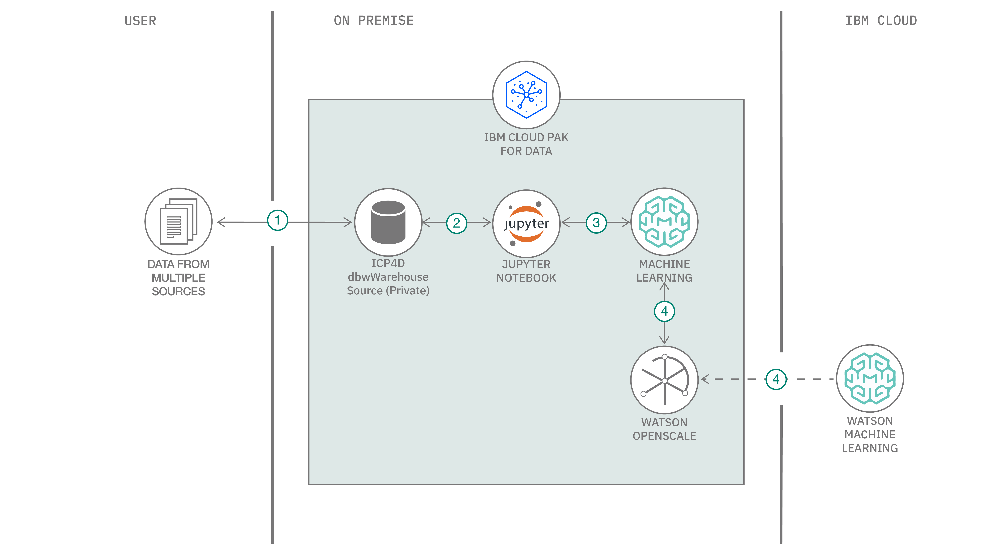

# Monitor your machine learning models using Watson OpenScale in IBM Cloud Pak for Data

Businesses today are increasingly certain that AI will be a driving force in the evolution of their industries over the next few years. To successful infuse AI into your product or solution, there are many factors that challenges its widespread adoption in the business and to achieving their expected outcomes. A few are listed below:

  1. Building trust - Organizations and businesses tend to be skeptical about AI because of its "black box" nature, resulting in many promising models no going into production.
  1. Algorithm bias - Another inherent problem with AI systems is that they are only as good – or as bad – as the data they are trained on. If the input data is filled with racial, gender, communal or ethnic biases, your model's accuracy is going to eventually drift away.
  1. Making decisions explainable - How can the model prove the reasoning behind its decision-making? It is critical that AI outcomes are fully explainable by keeping a complete track of the inputs and outputs of any AI-powered application.

What if there is one console that makes it easier for business users to track and measure AI outcomes?

In this code pattern we demonstrate a way to monitor your AI models in an application using Watson OpenScale. This will be demonstrated with an example of a Telecomm Call Drop Prediction Model. After the user has completed the code pattern, they will learn:

* How to store custom models using open source technology on Watson Machine Learning.
* How to deploy a model and connect the model deployment to Watson OpenScale on Cloud Pak for Data and on IBM Cloud.
* How to setup Model Fairness and Model Quality montiors with Watson OpenScale on Cloud Pak for Data and on IBM Cloud, using a python notebook.
* How to create a project and setup a python notebook on Cloud Pak for Data.



## Flow

1. Data stored into Cloud Pak for Data internal Db.
1. The joined data is stored back to the internal Db of Cloud Pak for Data and assigned to the current working project.
1. Create machine learning models using Jupyter Python notebooks to predict call drop, one cell tower at a time.
1. Model trained and/or stored in Watson Machine Learning, which is also connected to Watson OpenScale.
1. Configure Fairness, Quality and Explainability Montiors for each cell tower's model, and present within Cloud Pak for Data, or on other external Clouds (Multi-Cloud Architecture).

## Featured technologies

* [Jupyter Notebooks](https://jupyter.org/): An open-source web application that allows you to create and share documents that contain live code, equations, visualizations, and explanatory text.
* [Pandas](https://pandas.pydata.org/):  An open source library providing high-performance, easy-to-use data structures and data analysis tools for the Python programming language.

## Prerequisites

* An [IBM Cloud Account](https://cloud.ibm.com).
* [IBM Cloud Pak for Data](https://www.ibm.com/in-en/products/cloud-pak-for-data)
* [Watson OpenScale Add On for Cloud Pak for Data](https://cloud.ibm.com/docs/services/ai-openscale-icp?topic=ai-openscale-icp-inst-install-icp)

## Steps

1. [Create a Watson Machine Learning instance](#1-create-a-watson-machine-learning-instance)
1. [Create a new project in Cloud Pak for Data](#2-create-a-new-project-in-cloud-pak-for-data)
1. [Upload the dataset to Cloud Pak for Data](#3-upload-the-dataset-to-cloud-pak-for-data)
1. [Import notebook to Cloud Pak for Data](#4-import-notebook-to-cloud-pak-for-data)
1. [Follow the steps in the notebook](#5-follow-the-steps-in-the-notebook)
1. [Display deployment in Watson OpenScale](#6-display-deployment-in-watson-openscale)
1. [Additional use-case for Watson OpenScale](#7-additional-use-case-for-watson-openscale)

### 1. Create a Watson Machine Learning instance

* Create a new [Watson Machine Learning](https://cloud.ibm.com/catalog/services/machine-learning) instance on IBM Cloud. Log in to IBM Cloud or sign up for IBM Cloud if you don't have an account by following the on-screen instructions.

* Select the location to `Dallas` region and hit create.

  

* Once the instance is created. Click on `Service Credentials`. Click on `New Credentials` and then click on `View Credentials`. Copy using the icon.

  

> **NOTE**: Save the credentials. It will be required when running the notebook.

### 2. Create a new project in Cloud Pak for Data

* Once you login to your Cloud Pak for Data instance. Click on the (☰) `menu` icon in the top left corner of your screen and click `Projects`.

  

* When you reach the Project list, click on `New Project`. You will get a pop-up, make sure to have the `Analytics Project` option and enter the desired name. Once you click on `Ok` you will go to a new screen. Click on `Create` to complete your project creation.

## 3. Upload the dataset to Cloud Pak for Data

Clone this repository:

```bash
git clone https://github.com/IBM/icp4d-telco-monitor-with-wml-openscale/
cd icp4d-telco-monitor-with-wml-openscale
```

In your project, choose `Data sets` from the left-hand menu, then click `+Add Data set`.

Click `Select from your local file system` to select the `call_drop_data_train.csv` file.

   

### 4. Import notebook to Cloud Pak for Data

In your project, choose `Notebooks` from the left-hand menu, then click `+Add Notebook`.

  

On the next panel, select the `From URL` tab and enter the notebook URL: [https://github.com/IBM/icp4d-telco-monitor-models-with-wml-openscale/blob/master/notebook/Setup_your_AIOS_Dashboard.ipynb](https://github.com/IBM/icp4d-telco-monitor-models-with-wml-openscale/blob/master/notebook/Setup_your_AIOS_Dashboard.ipynb)

  

> **Note**: Choose the Python 3.6 environment.

### 5. Follow the steps in the notebook

You will run cells individually by highlighting each cell, then either click the `Run` button at the top of the notebook. While the cell is running, an asterisk (`[*]`) will show up to the left of the cell. When that cell has finished executing a sequential number will show up (i.e. `[17]`).

#### Install the Necessary Packages

* Click on the `Run` icon and install the necessary packages described in the first 3 cells.
* Next, restart your kernel by either clicking the restart icon or `Kernel > Restart`.

#### Add the Dataset

In section `2.2 Add Dataset`, highlight the blank cell by clicking on it. Click on the *10/01* button to select a specific data set.

Choose the `Local` tab, and select the `call_drop_data_train.csv` file that you added to the project. Under the `Insert to code` option, click `Insert Pandas DataFrame`.

> **IMPORTANT**:  Ensure the variable name is set to `df_data_1`.

#### Supply the neccessary variables and credentials

* Under section `2.1 Global Variables` enter the following:

  * Your desired Model Name
  * Your desired Model Deployment Name
  * The name of an `empty` schema in your database

  > **Note** : Make sure you have an empty schema, i.e. it has no content.

* Under section `2.3 Add your WML Credentials`, add the credentials you had copied earlier when creating the Watson Machine Learning instance.

* Under section `2.4 Update your AIOS Credentials`, add the necessary Cloud Pak for Data instance details as instructed in the cell.

  * Replace the <> with the information within the brackets.

* Under section `2.5 Add your Db Credentials`, add your database credentials and make sure the keys given in the template have values filled in.

> **NOTE**: For details on how to setup a connection to a Db2 instance that is associated with your Cloud Pak for Data cluster, view the tutorial [Building Dashboards in Cognos Analytics using IBM Cloud Pak for Data]().

#### Add the Subscription ID

* Continue running the notebook up to section `4.5 Create a new Subscription`.
* Before runnning the remaining cells (again, please keep in mind it is better run cell by cell), update the variable `subscription_id` in section `4.6 Perform Inital Payload Logging`, with the ID you created in the previous cell.
* You will find this id in the table above the cell, as instructed in the notebook.
* Now, run the rest of the notebook to completion.

### 6. Display deployment in Watson OpenScale

* Open the Watson Openscale add-on on Cloud Pak for Data. Click the `add-ons` icon located in the top right corner of the panel, which will show the list of add-ons. Use the option menu in the Watson OpenScale add-on tile to open it.

  

* You will see the initial setup looking like this:

  

### 7. Additional use-case for Watson OpenScale

Included in the data directory of this repo is a file named [Telco_training_final.csv](https://github.com/IBM/icp4d-telco-monitor-models-with-wml-openscale/blob/master/data/Telco_training_final.csv)). This contains call drop data for multiple cell towers. If you filter the data on the field `outgoing_site_id`, you can create a file for each cell tower you would like to monitor. Using the same notebook, you can create a new deployment for each model.

In the following description, we show a dashboard that consists of call drop prediction models for 3 different towers - A, B and C.

OpenScale is configured so that it can monitor how your models are performing over time. The following screen shot gives one such snapshot:

   

As we can see, the model for Tower C demonstrates a fairness bias warning of 92%.

#### What is a fairness-bias and why do we need to mitigate it?

Data in this day and age comes from a wide variety of sources. Being able to give the right input to a machine learning model is crucial to generating a succesful machine learning implementation in an application. However, if the underlying data is biased in any form, there is a risk that structural inequalities and unfair biases are not just replicated, but also amplified.

Hence, Watson OpenScale is useful when you need to identify the bias, in real-time (i.e., when payload flows into your machine learning system).

Now, that we have identified a bias, let us see the consequence of the bias and what exactly is causing the bias in this example.

##### Understanding bias

Select the desired deployment using `options > View Details`. You will see a full dashboard with various charts telling you how your model has been performing over various time intervals.

You may not receive the same values as the below screenshots. Since we have only done an initial setup, you will have only see one line in your charts.

   

Now select `_conds` in the `Fairness` menu on the left side. If you hover over the graph, you can select `Click to view details`. Select a timeline according to your current date.

To interpret the details, have a look at the screenshot below:

   

Our dataset contains the fields: `Clear`,`Fog`,`Haze`, `Partly Cloudy`, and `Rain`. The graph above suggests the field `Fog` contains a bias.

##### So, what does this really mean?

As we can see with the legend, we have the `Favorable Outcome` and `Unfavorable Outcome`. With this bias value we see that with the field value `Fog` compared to the values has a lesser % of favorable outcomes. Why does this affect my model? It creates a disparity and thereby allows your model to be biased towards the unfavorable outcome (in the case of `fog`).

##### Ok, so why does it really matter to me?

The best way to explain the consequence of the disparity is by taking this example - suppose we allow the disparity to creep in. Our model will slowly start believing that the moment the weather condition is foggy, it needs to predict the unfavorable outcome(1), and in this case the call will drop. Now, this may not be the case in reality. There maybe other conditions along with the fog that is causing call drops. Hence, it is important to keep monitoring your machine learning model on a real-time basis.

#### Understanding quality monitors

Now click on the `View Transactions` button shown in the previous screen shot. You will be presented with a list of each transaction. A transaction is basically the records
of all the data that flows into your model. It gives you the logs and if there is a bias identified, it will also be specified.

##### How to see your model performance

Come back to the dashboard and explore the `Area under ROC` section. Again, hover over the graph and select `Click to view details`.

  

In this example, we have setup only the `Area under ROC` as a quality measure. As shown in the above image.

You will receive estimates and the configured quality montor values, as shown below. The image shows the overall `True Positive` and `False Positive` ratio for the monitored model.

   

## License

This code pattern is licensed under the Apache License, Version 2. Separate third-party code objects invoked within this code pattern are licensed by their respective providers pursuant to their own separate licenses. Contributions are subject to the [Developer Certificate of Origin, Version 1.1](https://developercertificate.org/) and the [Apache License, Version 2](https://www.apache.org/licenses/LICENSE-2.0.txt).

[Apache License FAQ](https://www.apache.org/foundation/license-faq.html#WhatDoesItMEAN)
