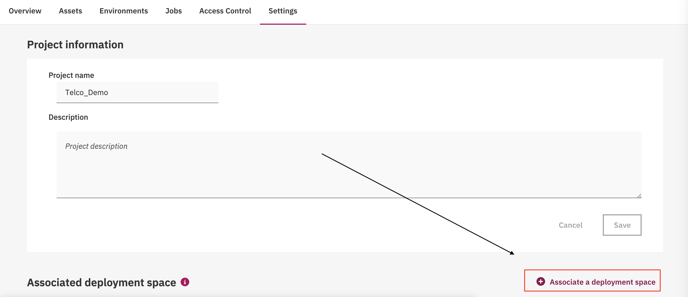
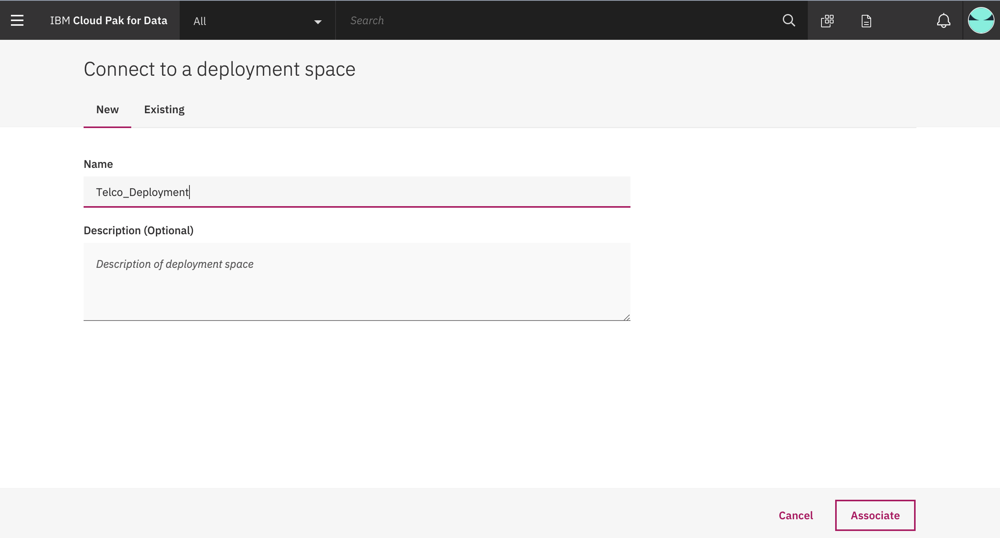
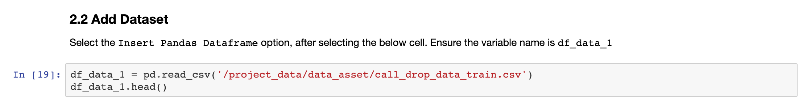
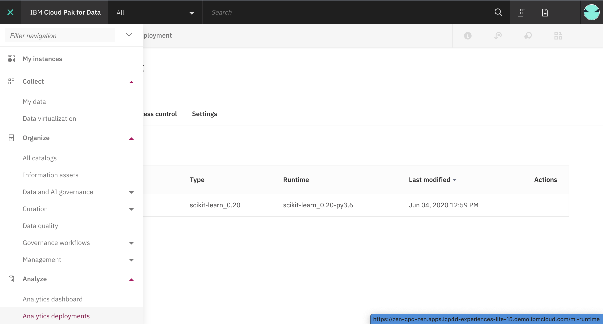
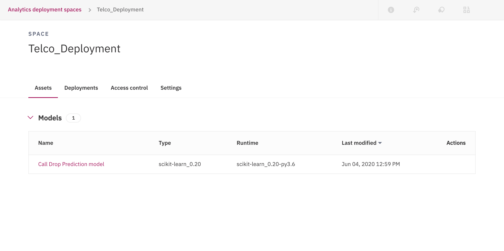
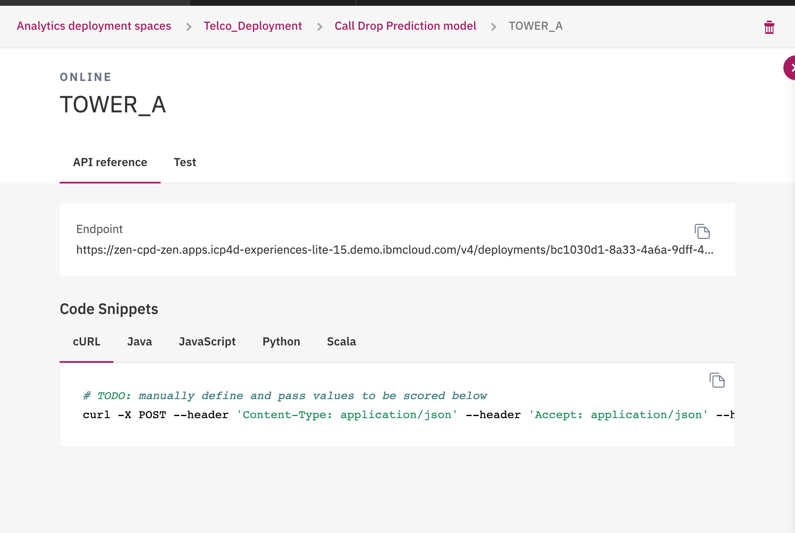

# Deploy your Custom Model using Internal WML CPD

This tutorial, helps you setup and deploy your custom-built open source model on your Watson Machine Learning Service inbuild within your Cloud Pak for Data environment. 

For this part, we will retain the same Call Drop example, from the main code pattern. 
> **Note:** This tutorial demonstrates with CPD v2.5+

## Pre-requisite

* Any Database (This tutorial Demonstrates with [Db2 on Cloud](https://cloud.ibm.com/catalog/services/db2))
* Cloud Pak for Data with WML, Watson Studio add-ons. (Check out - https://www.ibm.com/products/cloud-pak-for-data for a free 7 day trial!!)

## Steps

### 1. Create a new project in Cloud Pak for Data

* Once you login to your Cloud Pak for Data instance. Click on the (☰) `menu` icon in the top left corner of your screen and click `Projects`.

  

* When you reach the Project list, click on `New Project`. You will get a pop-up, make sure to have the `Analytics Project` option and enter the desired name. Once you click on `Ok` you will go to a new screen. Click on `Create` to complete your project creation.

### 2. Create a new Deployment Space

* Go to the `Settings` tab. Click on `Associate a Deployment Space`

   
   
* Enter a name for the new space and store this name, for future reference.

    

> ** Note: ** If you already have Deployment Space created for your project. Skip this step and store the name for future reference

### 3. Upload the dataset to Cloud Pak for Data

Clone this repository:

```bash
git clone https://github.com/IBM/icp4d-telco-monitor-with-wml-openscale/
cd icp4d-telco-monitor-with-wml-openscale
```

In your project, choose `Data sets` from the left-hand menu, then click `+Add Data set`.

Click `Select from your local file system` to select the `call_drop_data_train.csv` file.

   
 


### 4. Import notebook to Cloud Pak for Data

In your project, choose `Notebooks` from the left-hand menu, then click `+Add Notebook`.

  

On the next panel, select the `From URL` tab and enter the notebook URL: https://github.com/IBM/icp4d-telco-monitor-models-with-wml-openscale/blob/master/notebooks/WML-Demo.ipynb

  
  

### 5. Configure and Run the notebook

### Configure the notebook

* Under Section `2.1 Global Variables` in the notebook, enter the deployment space name, from the previous steps.

  
  
* Under Section `2.2 Add Dataset`. Click on the `10/01` icon and under the option `Insert to Code`, click on `Insert Pandas Dataframe` for the dataset inserted in the previous step.

   
### Run the notebook

You will run cells individually by highlighting each cell, then either click the Run button at the top of the notebook. While the cell is running, an asterisk ([*]) will show up to the left of the cell. When that cell has finished executing a sequential number will show up (i.e. [17]).

NOTE: For reference, we have included a completed notebook in the /examples directory of this repo. This version of the notebook includes all the executed steps and outputs. See https://github.com/IBM/icp4d-telco-monitor-models-with-wml-openscale/blob/master/examples/Setup_your_AIOS_Dashboard-Example.jupyter-py36.ipynb

Install the Necessary Packages
Click on the Run icon and install the necessary packages described in the first 3 cells.
Next, restart your kernel by either clicking the restart icon or Kernel > Restart.


### View and Analyze your Deployment

* Click on the (☰)`menu` icon in the top left corner of your screen and under the drop down of `Analyze`, click on `Analytics Deployments`

    
    
* Click on `Deployments` tab to see the current Deployment created by your WML custom model.

    

* You will see two tabs, where you have API endpoints that you can use as a scoring endpoint for you created and deployed model.

    
    
* To test the Scoring endpoint. Copy paste the code from [Scoring.py](https://github.com/IBM/icp4d-telco-monitor-models-with-wml-openscale/blob/master/notebooks/scoring.py) into your notebook cell and click on the `run` button to see the output.
